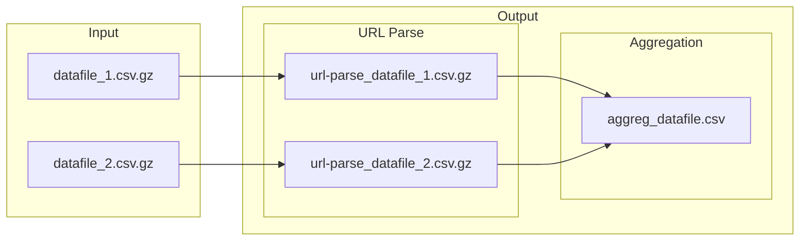

# Modular workflow for parsing and enriching URL data

The modular workflow will be composed of several steps (added as needed):
1. The first module (`aggregate.py`) takes in any dataset that includes URLs, such as a collection from [`gazouilloire`](https://github.com/medialab/gazouilloire). The objective of this module is to yield two types of enriched documents: (1) an aggregate of all in-files' URLs, enriched with metadata parsed from the URL, and (2) enriched versions of the in-files.

[*maybe*]

2. (`extract.py`) : download HTML with `minet fetch` and, when an online article, extract the main text.
3. (`request.py`) : call APIs, i.e. resolve certain URLs with `minet multithreaded_resolve()`, call the YouTube and/or Twitter API to retrieve special metadata about a resource on the platform.


# 1. `src/main.py`
```shell
python src/main.py DATA/
```

---
## Performance Tests

|test|files|total time|
|--|--|--|
|10-02-2023|26G + 25G (compressed)|--|

|file|command|time elapsed|
|--|--|--|
|26G|extracting relevant columns|0:03:47|
|26G|importing columns to database|0:02:10|
|26G|merging imported data to main table|0:01:09|
||||
|25G|extracting relevant columns|0:03:43|
|25G|importing columns to database|0:02:19|
|25G|merging imported data to main table|0:01:31|
||||
|--|aggregating links|0:01:02|
|--|parsing urls with minet|0:07:26|

---





