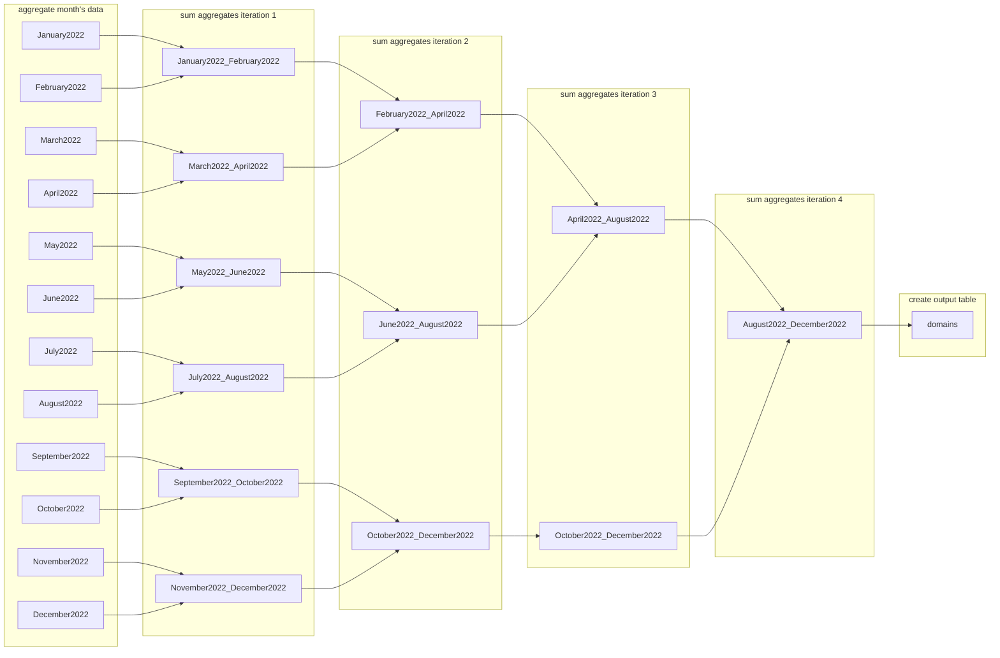

# Enlinkenment

A modular workflow for parsing and enriching URL data.

---
## Table of Contents
- [Installation](#installation)
- [Performance](#performance)
- [Workflow](#workflow)
---
## Installation
1. Create a new virtual environment with Python 3.11.
1. Clone the repository from GitHub onto your local machine.
    ```shell
    git clone git@github.com:medialab/enlinkenment.git
    cd enlinkenment
    ```
2. Install Python dependencies.
    ```shell
    pip install -r requirements.txt
    ```
3. Run the process [`src/main.py`](src/main.py) on your data file or on a directory containing data files with a `.csv` or `.gz` extension.
    ```shell
    python src/main.py ./DATA/DIRECTORY/
    ```

---
## Performance


---
## Workflow

### Input Data

1. Stream the CSV and select the relevant columns. Save them to a parquet file.
    - 3.5 - 4 minutes (for a file of ~26 GB)

2. Using `duckdb`, parse the parquet file and explode concatenated links in a tweet's `links` column.
    - 20-30 seconds

3. Parse those exploded links with `ural` and write the result to a new parquet file.
    - 7 - 15 minutes (depends on how many URLs are in the month's data)

4. Write the parsed URLs to a parquet file.
    - ~20 seconds

5. Parse the `local_time` field in all the processed parquet files and get a set of all the months in the data.

6. Create tables in the database for each month.

7. Again, parse the processed URL parquet file. This time, input the data in the proper month's table.

### Aggregate Data


