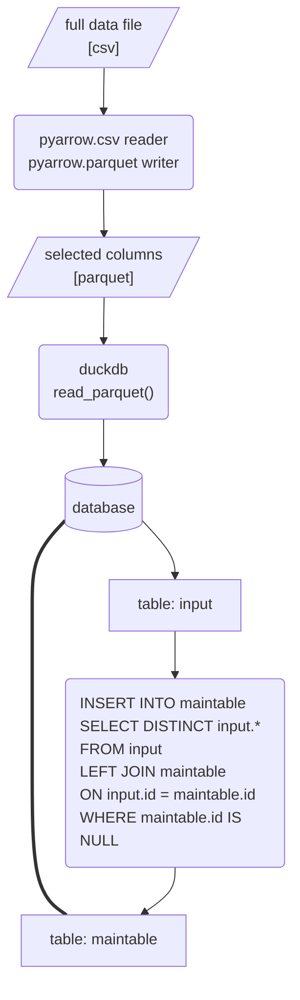

# Enlinkenment

A modular workflow for parsing and enriching URL data.

---
## Table of Contents
- [Installation](#installation)
- [Performance](#performance)
- [Process](#process)
---
## Installation
1. Create a new virtual environment with Python 3.11.
1. Clone the repository from GitHub onto your local machine.
    ```shell
    git clone git@github.com:medialab/enlinkenment.git
    cd enlinkenment
    ```
2. Install Python dependencies.
    ```shell
    pip install -r requirements.txt
    ```
3. Run the process [`src/main.py`](src/main.py) on your data file or on a directory containing data files with a `.csv` or `.gz` extension.
    ```shell
    python src/main.py ./DATA/DIRECTORY/
    ```

---
## Performance
26G compressed (December 2022) + 25G compressed (November 2022)

|step|action|duration|
|--|--|--|
|preprocess data|26G compressed file|0:03:49|
||25G compressed file|0:03:43|
|||
|data import|create main table scheme|0:00:00|
||read pre-processed 26G file to database|0:01:01|
||insert imported data to main table|0:00:17|
||read pre-processed 25G file to database|0:00:54|
||insert imported data to main table|0:00:25|
|||
|parse urls|explode links and relate to tweet id|0:02:04|
||aggregate links|0:00:10|
||parse unique links with URAL|0:03:28|
||compile cleaned parsed results to pyarrow table|0:00:06|
||create database table from pyarrow table|0:00:05|
|||
|aggregate links|de-aggregate links and enrich exploded links table|0:01:27|
||aggregate enriched links|0:03:51|
|||
|aggregate domains|associate domains to tweets|0:00:23|
||aggregate links by domain|0:02:37|

finished in 0:24:29

---
## Process

### Pre-process & import
Large CSV file(s) are opened and streamed in chunks using `pyarrow.csv.open_csv()`. Only a selection of the columns in the CSV are parsed:
```
['id', 'timestamp_utc', 'local_time', 'retweet_count', 'like_count', 'reply_count', 'user_id', 'user_followers', 'user_friends', 'retweeted_id', 'retweeted_user_id', 'quoted_id', 'quoted_user_id', 'links']
```
Chunks of the parsed data are iteratively added to a `pyarrow` table, using `pyarrow.Table.from_batches()`, which is then iteratively written to a parquet file in the created subdirectory `output/`. If the given input is a directory, the process is repeated for as many CSV data files are in the directory.

The database management system `duckdb` then creates a temporary table from that parquet file. Finally, `duckdb` merges the temporary input table into a central table for all imported tweet data, avoiding any duplicates.
