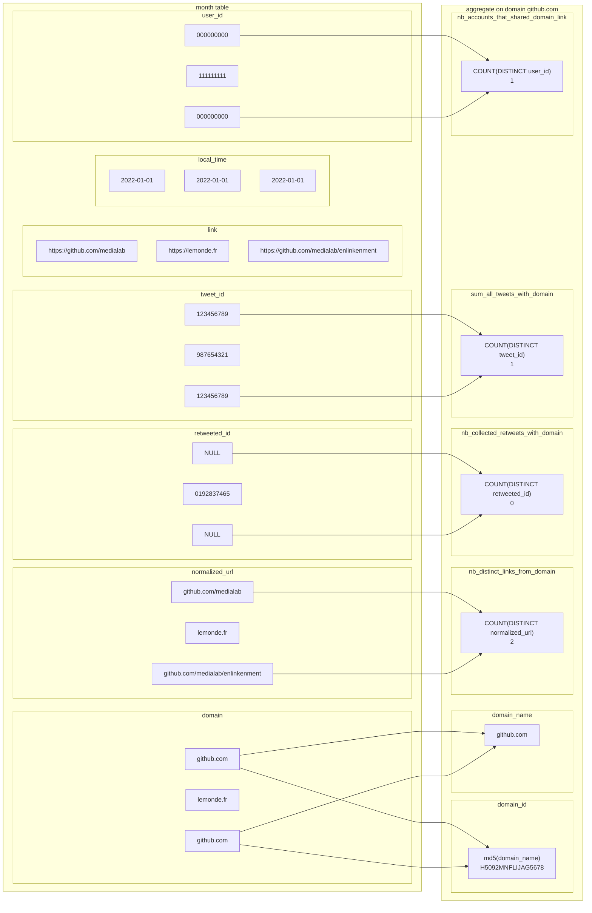
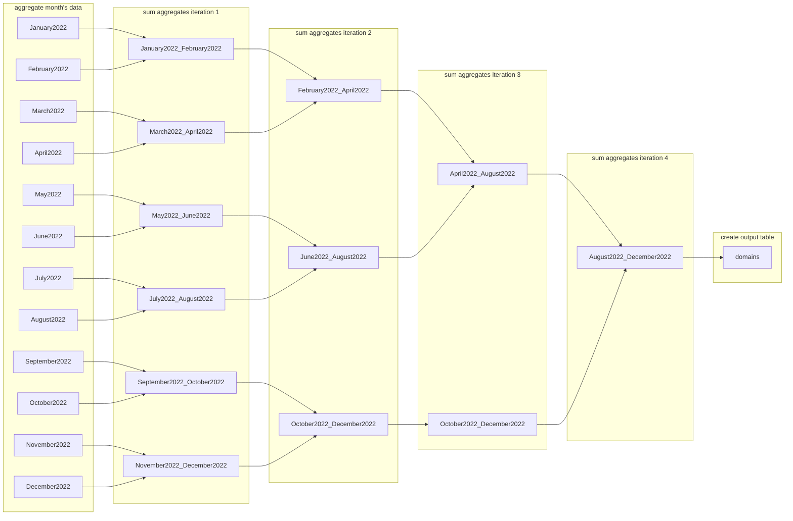

# Enlinkenment

A modular workflow for parsing and enriching URL data.

---
## Table of Contents
- [Installation](#installation)
- [Performance](#performance)
- [Workflow](#workflow)
---
## Installation
1. Create a new virtual environment with Python 3.11.
1. Clone the repository from GitHub onto your local machine.
    ```shell
    git clone git@github.com:medialab/enlinkenment.git
    cd enlinkenment
    ```
2. Install Python dependencies.
    ```shell
    pip install -r requirements.txt
    ```
3. Run the process [`src/main.py`](src/main.py) on your data file or on a directory containing data files with a `.csv` or `.gz` extension.
    ```shell
    python src/main.py ./DATA/DIRECTORY/
    ```

---
## Performance

Test of 12 months' worth of data (15 March 2023)

### Input data
total time: 3:30:27

|month|file size compressed|1. Extract columns|2. Explode links|3. Parse domains|4.Write processed data|total|
|--|--|--|--|--|--|--|
|January 2022|30.1288 GB|04:04|00:31|16:46|00:25|43819155|
|February 2022|27.8977 GB|03:46|00:29|14:59|00:23|39191319|
|March 2022|31.2316 GB|04:13|00:32|15:58|00:24|41718621|
|April 2022|30.5343 GB|04:09|00:33|15:25|00:23|40205107|
|May 2022|26.9154 GB|03:38|00:28|14:46|00:23|38914378|
|June 2022|26.4667 GB|03:34|00:27|14:17|00:22|36981894|
|July 2022|24.9914 GB|03:22|00:25|12:56|00:20|33200632|
|August 2022|24.9034 GB|03:21|00:25|12:39|00:20|32593532|
|September 2022|26.5168 GB|03:34|00:27|13:18|00:20|34702120|
|October 2022|28.5757 GB|03:50|00:28|07:42|00:12|19032604|
|November 2022|27.1096 GB|03:39|00:26|07:06|00:11|17489343|
|December 2022|27.6541 GB|03:43|00:28|07:03|00:11|17356389|

## Insert data
total time: 00:13:16

## Aggregate data
total time: 00:00:51

## Time of entire workflow:
03:44:40

---
## Workflow

### Input data

- For each CSV file:

    1. Stream the file and select the relevant columns. Save them to a parquet file.
        - 3.5 - 4 minutes (for a file of ~26 GB)

    2. Using `duckdb`, parse the parquet file and explode concatenated links in a tweet's `links` column.
        - 20-30 seconds

    3. Parse those exploded links with `ural` and write the result to a new parquet file.
        - 7 - 15 minutes (depends on how many URLs are in the month's data)

    4. Write the parsed URLs to a parquet file.
        - ~20 seconds

- For each pre-processed data file (1st loop)

    5. Parse the `local_time` field to get a set of all the months in the data
        - < 10 seconds

- For every month in the set

    6. Create a table in the database, titled MonthYear. (eg. March2023)
        - 0 seconds

- For each pre-processed data file (2nd loop)

    7. Insert the tweet data into the proper month's table.
        - ~13 minutes

### Aggregate data

1. For every month table

    - Group by `domain_name` and aggregate the desired fields (eg. sum on `retweet_id`)
        - < 1 minute

Below, see the result of the group-by function for the domain `github.com`. In this example, one tweet originally contained two links (both from `github.com`) and another contained one link (from `lemonde.fr`). Through the previous processing, the first tweet's concatenated links were exploded and moved onto separate rows in the month's table.
|id|...|links|
|--|--|--|
`123456789`|...|`https://github.com/medialab\|https://github.com/medialab/enlinkenment`
`987654321`|...|`https://lemonde.fr`



2. Iteratively pair up months
    - Sum 2 aggregated month tables
        - ~ 3 seconds (for all iterations, pairs)


