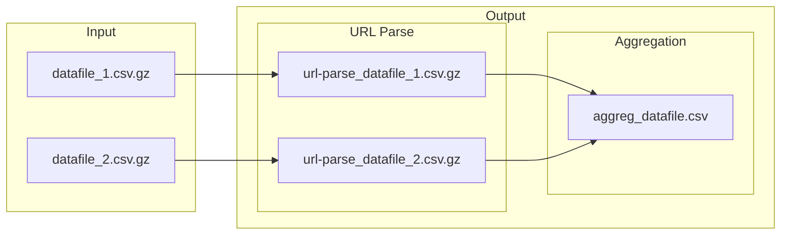

# Modular workflow for parsing and enriching URL data

The modular workflow will be composed of several steps (added as needed):
1. The first module (`aggregate.py`) takes in any dataset that includes URLs, such as a collection from [`gazouilloire`](https://github.com/medialab/gazouilloire). The objective of this module is to yield two types of enriched documents: (1) an aggregate of all in-files' URLs, enriched with metadata parsed from the URL, and (2) enriched versions of the in-files.
2. The second module (`extract.py`) fetches HTML with `minet fetch` and, when applicable, extracts the main text from online articles.
3. The third module (`request.py`) further enriches the data by calling APIs. These calls may include the following: resolving certain URLs with `minet multithreaded_resolve()` and calling the YouTube and/or Twitter API to retrieve special metadata about a resource on the platform.


# 1. `aggregate.py`
The first step is to parse the incoming data file(s) and aggregate the URLs in them. In case this is all you want to do, this module can be called on its own.

Below is an example of how to call the aggregation script for a `gazouilloire` Twitter data set, with the name of the URL column being `links`, the name of the ID column being `id`, and the `tweets` flag set to True, and the flag `--no-retweets` set to true, which adds a step to the data file(s)' preprocessing.
```shell
$ python main.py --url-col 'links' --id-col 'id' --tweets DATAFILE.csv.gz
```
- `--url-col` [str, required] : name of the column that contains the URLs to be analyzed
- `--id-col` [str, optional] : name of the column that contains the CSV file's unique IDs (i.e. the Tweet ID)
- `--tweets/--no-tweets` [bool, optional] : flag to indicate that the data file contains tweets, which will result in (i) some of the aggregated file's headers being renamed so that their meaning is clearer and (ii) a new column in which is concatenated a list publication dates for each URL
- `--no-retweets/--retweets` [bool, optional] : flag to indicate whether retweets are excluded from the aggregate of URLs and the parsed file(s); this is useful for Twitter data because a retweet will contain in the `links` field the URL of the original tweet, which might not be interesting for a study of links shared on Twitter
- `datafile` [filepath, required] : path to the CSV file

> Note: If using the `aggregate.py` script to analyze links shared on Twitter, you should (1) pass the name of the ID column to the option `--id-col`, (2) call the flag `--tweets`, and (3) call the flag `--no-retweets` in order to remove links that are merely links to retweeted tweets.



Multiple files can be passed to the command by directly naming them.

```shell
$ python main.py --url-col 'links' --id-col 'id' FILE_1.csv FILE_2.csv
```

To process multiple files in a folder, pass the standard output from a `ls` command.
```shell
$ python main.py --url-col 'links' --id-col 'id' $(ls data/*.csv)
```

# What the `aggregate.py` workflow does
## Step 1. Pre-process data file

If the flag `--no-retweets` is True, the `xsv explode` command will be prececed by an initial pre-processing that removes all retweets and tweets without links.

```shell
$ gzcat DATAFILE.csv.gz | xsv search -s retweet_id -v "." | xsv search -s links "." > gzip TEMPFILE.csv
```

In all cases, the `xsv` command `explode` is used to separate any concatenated URLs onto their own rows in the CSV.

```shell
$ gzcat DATAFILE.csv.gz | xsv explode -o PREPROCESSED.csv links "|"
```


## Step 2. Parse and count URLs

### Part I.

Using the `URAL` Python library and `minet`'s multithreaded process, links in the `--url-col` are parsed in order to get basic metadata.

```shell
$ minet url-parse -o PARSED.csv links PREPROCESSED 1.csv
```


Columns added to the data file(s) (see [minet documentation](https://github.com/medialab/minet/blob/master/docs/cli.md#url-parse)):
* `normalized_url`: urls aggressively normalized by removing any part that is not useful to determine which resource it is actually pointing at.
* `inferred_redirection`: redirection directly inferred from the url without needing to make any HTTP request.
* `domain_name`: TLD-aware domain name of the url.
* hostname`: full hostname of the url.
* `normalized_hostname`: normalized hostname, i.e. stripped of "www", "m" or some language subdomains etc., of the url.
* `shortened`: whether the url is probably shortened or not (bit.ly, t.co etc.).
* `typo`: whether the url probably contains typo or not (such as inclusive language in french : curieux.se etc.).
* `homepage`: whether the given url looks like a website's homepage.
* `should_resolve`: whether the given url looks like something we should resolve, i.e. shortened url.

### Part II.

Using `xsv`, the frequency of each normalized URL and domain in the dataset is counted.

```shell
xsv frequency -o FREQUENCY.csv -s 'normalized_url,domain_name' -l 0 --no-nulls PARSED.csv
```


### Part III.

Data in the newly created frequency CSV is serialized. Then, by iterating through the enriched data file, those frequency counts are added to the relevant rows. During this enrichment process, the program takes advantage of the loop through in order to aggregate data by normalized URL.

Columns added to the data file(s):
- `url_count` : number of times that row's URL appeared in the data file
- `domain_count` : number of times that row's domain appeared in the data file

Finally, the enriched data file is closed and compressed. Since it contains the original data plus the enriched data, the file might be quite large and compression might be important.

## Step 3. Aggregate URLs

Aggregates of all the data files' URLs are then written to the a new CSV file, whose columns depend on the flags declared in the Python command.

Columns added in all cases (includes all fields in `minet url-parse`):

- `normalized_url`*
- `infered_redirection`*
- `domain_name`*
- `hostname`*
- `normalized_hostname`*
- `shortened`*
- `typo`*
- `homepage`*
- `should_resolve`*
- `raw_url` : an unaltered version of the normalized URL
- `url_count` : the number of times this URL (according to its normalized version) appeared across all input data files
- `domain_count` : the number of times this domain appeared across all input data files

\* From [`minet url-parse`](https://github.com/medialab/minet/blob/master/minet/cli/url_parse.py) 

If the flag `--id-col` was declared, but not `--tweets` (meaning the IDs should be counted but the data should not be treated as if it is Twitter data), the following columns are added:
- `sources_ids` : concatenation of the IDs of all the data files' rows that contained the aggreagte row's URL
- `n_sources_with_url` : sum of all the rows that contained the URL

If the flag `--tweets` was declared along with `--id-col` (recommended), the following columsn are added:
- `tweet_ids` : concatenation of the IDs of all the tweets that contained the aggregate row's URL
- `tweet_localtimes` : concatenation of all the `local_time` date-times of the tweets the contained the URL
- `n_tweets_with_links` : sum of all the tweets that contained the URL

## Step 4. Enrich the URL aggregates

Using sub-commands from `minet url-parse`, extra metadata is parsed from the URL. This is the last data added without every calling an API. For more information about the columns added, see [`minet url-parse` code](https://github.com/medialab/minet/blob/master/minet/cli/url_parse.py).

### Part I. 
Add Facebook data with `xsv url-parse --facebook`

Columns added:
- `facebook_type` : if the URL is a Facebook URL, the name of the type of Facebook resource (according to `minet`'s taxonomy)
- `facebook_id` : primary ID of the Facebook resource
- `facebook_full_id` : if the Facebook resource is a post, a second "full" ID identitying
- `facebook_handle` : if the Facebook resource is a post or user, the user's handle
- `facebook_normalized_url` : normalized version of Facebook URL

### Part II.
Add Twitter data with `xsv url-parse --twitter`

Columns added:
- `twitter_type` : if the URL is a Twitter URL, the name of the type of Twitter resource (according to `minet's` taxonomy)
- `twitter_user_screen_name` : Twitter user's screen name
- `tweet_id` : ID of the tweet

### Part III.
Add YouTube data with `xsv url-parse --youtube`

Columns added:
- `youtube_type` : if the URL is a YouTube URL, the name of the type of YouTube resource (according to `minet's` taxonomy)
- `youtube_id` : the ID of the YouTube resource
- `youtube_name` : the handle of the YouTube channel or user
