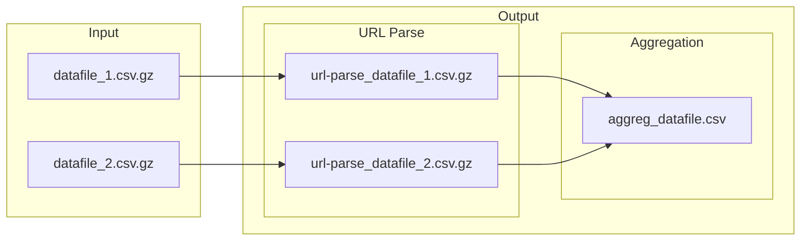

# Modular workflow for parsing and enriching URL data

The modular workflow will be composed of several steps (added as needed):
1. The first module (`aggregate.py`) takes in any dataset that includes URLs, such as a collection from [`gazouilloire`](https://github.com/medialab/gazouilloire). The objective of this module is to yield two types of enriched documents: (1) an aggregate of all in-files' URLs, enriched with metadata parsed from the URL, and (2) enriched versions of the in-files.

[*maybe*]

2. (`extract.py`) : download HTML with `minet fetch` and, when an online article, extract the main text.
3. (`request.py`) : call APIs, i.e. resolve certain URLs with `minet multithreaded_resolve()`, call the YouTube and/or Twitter API to retrieve special metadata about a resource on the platform.


# 1. `aggregate.py`
The first step is to parse the incoming data file(s) and aggregate the URLs in them. In case this is all you want to do, this module can be called on its own.


```shell
$ python main.py --url-col 'links' --id-col 'id' --tweets --no-retweets DATAFILE.csv.gz
```
- `--url-col` [str, required] : name of the column that contains the URLs to be analyzed
- `--id-col` [str, optional] : name of the column that contains the CSV file's unique IDs (i.e. the Tweet ID)
- `--tweets/--no-tweets` [bool, optional] : flag to indicate that the data file contains tweets, which will result in (i) some of the aggregated file's headers being renamed so that their meaning is clearer and (ii) a new column in which is concatenated a list publication dates for each URL
- `--no-retweets/--retweets` [bool, optional] : flag to indicate whether retweets are excluded from the aggregate of URLs and the parsed file(s); this is useful for Twitter data because a retweet will contain in the `links` field the URL of the original tweet, which might not be interesting for a study of links shared on Twitter
- `datafile` [filepath, required] : path to the CSV file

---
### Performance Test

|test|file size (compressed)|total time|aggreg file size|url-parse file size (compressed)|
|--|--|--|--|--|
|1-02-2023|25G|0:17:47|9.2M|2.4G|

|command|time elapsed|
|--|--|
|xsv removing retweets|0:03:44|
|xsv pre-processing|0:00:28|
|minet url-parse|0:08:41|
|xsv frequency|0:00:20|
|enrichment & aggregation|0:04:15|
|writing aggregates|0:00:15|
|url-parse facebook|0:00:02|
|url-parse twitter|0:00:01|
|url-parse youtube|0:00:01|

---




Multiple files can be passed to the command by directly naming them.

```shell
$ python main.py --url-col 'links' --id-col 'id' --tweets --no-retweets FILE_1.csv FILE_2.csv
```

To process multiple files in a folder, pass the standard output from a `ls` command.
```shell
$ python main.py --url-col 'links' --id-col 'id' --tweets --no-retweets $(ls data/*.csv)
```
[schematic](docs/aggregate.md)

---
