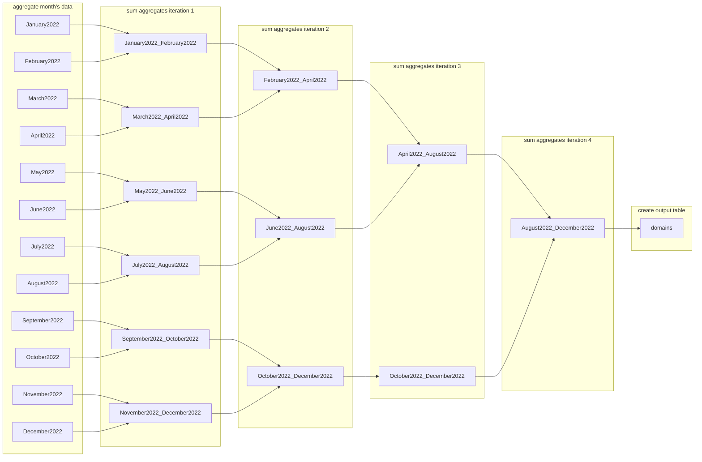

# Enlinkenment

A modular workflow for parsing and enriching URL data.

---
## Table of Contents
- [Installation](#installation)
- [Performance](#performance)
- [Workflow](#workflow)
---
## Installation
1. Create a new virtual environment with Python 3.11.
1. Clone the repository from GitHub onto your local machine.
    ```shell
    git clone git@github.com:medialab/enlinkenment.git
    cd enlinkenment
    ```
2. Install Python dependencies.
    ```shell
    pip install -r requirements.txt
    ```
3. Run the process [`src/main.py`](src/main.py) on your data file or on a directory containing data files with a `.csv` or `.gz` extension.
    ```shell
    python src/main.py ./DATA/DIRECTORY/
    ```

## Output : `domains.csv`

The script writes the database's `domains` table to a CSV file with the following data fields:

- domain_id
- domain_name
- nb_distinct_links_from_domain
- nb_collected_retweets_with_domain
- sum_all_tweets_with_domain
- nb_accounts_that_shared_domain_link
- nb_tweets_in_MonthYEAR

... etc.
- nb_collected_original_tweets_with_domain
- median_of_tweets_per_month
- nb_months_with_tweet

The CSV file is ordered by `nb_accounts_that_shared_domain_link` so that the domain whose links the most number of unique users tweeted is the first row. There is a varying number of columns in the out-file because it adapts to the number of months in the data, as represented by the generic column name `nb_tweets_in_MonthYEAR`. If the tweet data were from the months January 2023 and February 2023, the columns listed above would include the following:
- nb_tweets_in_January2023
- nb_tweets_in_February2023

And the maximum value in the column `nb_months_with_tweet` would be 2.

---
## Performance

Test of 12 months' worth of data (15 March 2023)

### Input data
total time: 3:30:27

|month|file size compressed|1. Extract columns|2. Explode links|3. Parse domains|4.Write processed data|total|
|--|--|--|--|--|--|--|
|January 2022|30.1288 GB|04:04|00:31|16:46|00:25|43819155|
|February 2022|27.8977 GB|03:46|00:29|14:59|00:23|39191319|
|March 2022|31.2316 GB|04:13|00:32|15:58|00:24|41718621|
|April 2022|30.5343 GB|04:09|00:33|15:25|00:23|40205107|
|May 2022|26.9154 GB|03:38|00:28|14:46|00:23|38914378|
|June 2022|26.4667 GB|03:34|00:27|14:17|00:22|36981894|
|July 2022|24.9914 GB|03:22|00:25|12:56|00:20|33200632|
|August 2022|24.9034 GB|03:21|00:25|12:39|00:20|32593532|
|September 2022|26.5168 GB|03:34|00:27|13:18|00:20|34702120|
|October 2022|28.5757 GB|03:50|00:28|07:42|00:12|19032604|
|November 2022|27.1096 GB|03:39|00:26|07:06|00:11|17489343|
|December 2022|27.6541 GB|03:43|00:28|07:03|00:11|17356389|

## Insert data
total time: 00:13:16

## Aggregate data
total time: 00:00:51

## Time of entire workflow:
03:44:40

---
## Workflow

### Input data

- For each CSV file:

    1. Stream the file and select the relevant columns. Save them to a parquet file.
        - 3.5 - 4 minutes (for a file of ~26 GB)

    2. Using `duckdb`, parse the parquet file and explode concatenated links in a tweet's `links` column.
        - 20-30 seconds

    3. Parse those exploded links with `ural`.
        - 7 - 15 minutes (depends on how many URLs are in the month's data)

    4. Write the parsed URLs to a parquet file.
        - ~20 seconds

- For each pre-processed data file (1st loop):

    5. Parse the `local_time` field to get a set of all the months in the data.
        - < 10 seconds

- For every month in the set:

    6. Create a table in the database, titled MonthYear. (eg. March2023)
        - 0 seconds

- For each pre-processed data file (2nd loop):

    7. Reading the processed results from the parquet file, insert the data into the proper month table.
        - ~13 minutes

### Aggregate data

1. For every month table in the database:

    - Group by `domain_name` and aggregate the desired fields (eg. count distinct `retweeted_id` --> `nb_collected_retweets_with_domain`)
        - < 1 minute

> Below is an example of the aggregation applied to a table February2023 (all tweets and links from February 2023). In this example, the database includes tweets from the following months: January 2023, February 2023, March 2023. The SQL to populate the columns `nb_tweets_in_MonthYEAR` is generated by a Python function that adapts to the number of months in the dataset as well as the targeted table's order in that array.
```sql
INSERT INTO domains_in_February2023
SELECT
    md5(domain_name),
    domain_name,
    COUNT(DISTINCT normalized_url),
    COUNT(DISTINCT retweeted_id),
    COUNT(DISTINCT tweet_id),
    COUNT(DISTINCT user_id),
    0 as nb_tweets_in_January2023,
    COUNT(DISTINCT tweet_id) as nb_tweets_in_February2023,
    0 as nb_tweets_in_March2023
FROM February2023
WHERE domain_name IS NOT NULL
GROUP BY domain_name;
```

### `FROM` table
The aggregation selects from a table containing all the tweets and exploded links from a given month, i.e. February 2023.
|tweet_id|local_time|user_id|retweeted_id|link|normalized_url|domain_name|
|--|--|--|--|--|--|--|
1488285970210471944|2022-02-01T00:00:00|572770254|1488234322142375939|`https://github.com/medialab/enlinkenment`|`github.com/medialab/enlinkenment`|`github.com`
1488285969912672257|2022-02-01T00:00:00|4892727543|NULL|`https://www.lemonde.fr/`|`lemonde.fr`|`lemonde.fr`
1488285969912672257|2022-02-01T00:00:00|4892727543|NULL|`https://www.lefigaro.fr/`|`lefigaro.fr`|`lefigaro.fr`
1488285969740673027|2022-02-01T00:00:00|1488285969652621312|NULL|`https://www.lemonde.fr/`|`lemonde.fr`|`lemonde.fr`

### `INSERT INTO` table
The result is a table grouped by domain with calculations for aggregated fields.
    'domain_id':'VARCHAR',
    'domain_name': 'VARCHAR',
    'nb_distinct_links_from_domain':'UBIGINT',
    'nb_collected_retweets_with_domain':'UBIGINT',
    'sum_all_tweets_with_domain':'UBIGINT',
    'nb_accounts_that_shared_domain_link':'UBIGINT',

|domain_id|domain_name|nb_distinct_links_from_domain|nb_collected_retweets_with_domain|sum_all_tweets_with_domain|nb_accounts_that_shared_domain_link|nb_tweets_in_January2023|nb_tweets_in_February2023|nb_tweets_in_March2023|
|--|--|--|--|--|--|--|--|--|
99cd2175108d157588c04758296d1cfc|github.com|1|1|1|1|0|1|0|
faf9edb7a08ae4e8b56fc67a6ec6b45d|lemonde.fr|1|0|2|2|0|1|0|
e396f0b50ee394ef1ba57233d31a32aa|lefigaro.fr|1|0|1|1|0|1|0|

2. Iteratively pair up months:
    - Sum 2 aggregated month tables (eg. sum `nb_collected_retweets_with_domain`)
        - ~ 3 seconds (for all iterations, pairs)


