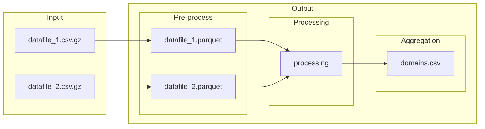

# Modular workflow for parsing and enriching URL data

The modular workflow will be composed of several steps (added as needed):
1. The first module (`aggregate.py`) takes in any dataset that includes URLs, such as a collection from [`gazouilloire`](https://github.com/medialab/gazouilloire). The objective of this module is to yield two types of enriched documents: (1) an aggregate of all in-files' URLs, enriched with metadata parsed from the URL, and (2) enriched versions of the in-files.

[*maybe*]

2. (`extract.py`) : download HTML with `minet fetch` and, when an online article, extract the main text.
3. (`request.py`) : call APIs, i.e. resolve certain URLs with `minet multithreaded_resolve()`, call the YouTube and/or Twitter API to retrieve special metadata about a resource on the platform.


# 1. Aggregate domains
```shell
python src/main.py ./DATA/DIRECTORY/
```

---
## Performance Tests
26G compressed (December 2022) + 25G compressed (November 2022)

|step|action|duration|
|--|--|--|
|preprocess data|26G compressed file|0:03:49|
||25G compressed file|0:03:43|
|||
|data import|create main table scheme|0:00:00|
||read pre-processed 26G file to database|0:01:01|
||insert imported data to main table|0:00:17|
||read pre-processed 25G file to database|0:00:54|
||insert imported data to main table|0:00:25|
|||
|parse urls|explode links and relate to tweet id|0:02:04|
||aggregate links|0:00:10|
||parse unique links with URAL|0:03:28|
||compile cleaned parsed results to pyarrow table|0:00:06|
||create database table from pyarrow table|0:00:05|
|||
|aggregate links|de-aggregate links and enrich exploded links table|0:01:27|
||aggregate enriched links|0:03:51|
|||
|aggregate domains|associate domains to tweets|0:00:23|
||aggregate links by domain|0:02:37|

finished in 0:24:29

---





