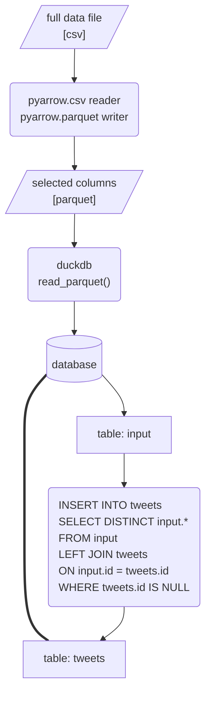
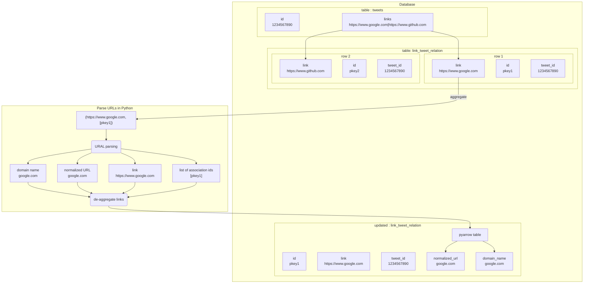

# Enlinkenment

A modular workflow for parsing and enriching URL data.

---
## Table of Contents
- [Installation](#installation)
- [Performance](#performance)
- [Workflow](#workflow)
---
## Installation
1. Create a new virtual environment with Python 3.11.
1. Clone the repository from GitHub onto your local machine.
    ```shell
    git clone git@github.com:medialab/enlinkenment.git
    cd enlinkenment
    ```
2. Install Python dependencies.
    ```shell
    pip install -r requirements.txt
    ```
3. Run the process [`src/main.py`](src/main.py) on your data file or on a directory containing data files with a `.csv` or `.gz` extension.
    ```shell
    python src/main.py ./DATA/DIRECTORY/
    ```

---
## Performance
26G compressed (December 2022) + 25G compressed (November 2022)

|step|action|duration|
|--|--|--|
|preprocess data|26G compressed file|0:03:49|
||25G compressed file|0:03:43|
|||
|data import|create main table scheme|0:00:00|
||read pre-processed 26G file to database|0:01:01|
||insert imported data to main table|0:00:17|
||read pre-processed 25G file to database|0:00:54|
||insert imported data to main table|0:00:25|
|||
|parse urls|explode links and relate to tweet id|0:02:04|
||aggregate links|0:00:10|
||parse unique links with URAL|0:03:28|
||compile cleaned parsed results to pyarrow table|0:00:06|
||create database table from pyarrow table|0:00:05|
|||
|aggregate links|de-aggregate links and enrich exploded links table|0:01:27|
||aggregate enriched links|0:03:51|
|||
|aggregate domains|associate domains to tweets|0:00:23|
||aggregate links by domain|0:02:37|

finished in 0:24:29

---
## Workflow

### Pre-process data
Large CSV file(s) are opened and streamed in chunks using `pyarrow.csv.open_csv()`. Only a selection of the columns in the CSV are parsed:
```
['id', 'timestamp_utc', 'local_time', 'retweet_count', 'like_count', 'reply_count', 'user_id', 'user_followers', 'user_friends', 'retweeted_id', 'retweeted_user_id', 'quoted_id', 'quoted_user_id', 'links']
```
Chunks of the selected columns are iteratively added to a `pyarrow` table, using `pyarrow.Table.from_batches()`, which is then iteratively written to a parquet file in the created subdirectory `output/`.

### Data import
The database management system `duckdb` then parses the select columns in the created parquet file and inserts them into a temporary table (`input`). Finally, `duckdb` merges the temporary `input` table into a central table (`tweets`) for all imported tweet data, avoiding any duplicates.


### Parse URLs
Writing to the disk/database, create a table (`link_tweet_relation`) of every association between every tweet and individual link in the main table.
```sql
CREATE SEQUENCE seq0;
INSERT INTO link_tweet_relation
SELECT NEXTVAL('seq0'), UNNEST(link_list) as link, tweet_id
FROM (
    SELECT STRING_SPLIT(s.links, '|') as link_list, id
    FROM (
        SELECT links, id
        FROM tweets
        WHERE links IS NOT NULL
    ) AS s
) tbl(link_list, tweet_id)
WHERE LEN(link_list) > 0;
```

To prevent parsing the same URL more than once, group by all links in the association table `link_tweet_relation` and aggregate the unique ID signifying the link's relation to a tweet.
```python
# Pull the table into memory
link_tweet_pairs = duckdb.table(
        table_name='link_tweet_relation',
        connection=connection
    )
# Use duckdb's aggregate method on the table
link_aggregate = link_tweet_pairs.aggregate(
        'link, STRING_AGG(id)'
    ).fetchall()
```

For each link, get the normalized version and the domain name. Then, to an in-memory `pyarrow` table, create columns for (a) the original link, (b) the normalized version, (c) the link's domain name, and (d) the aggregated list of the IDs that link has in the association table `link_tweet_relation` and write the parsed URL data to the `pyarrow table`. Finally, write the `pyarrow` table to disk/the database in a table.

```python
duckdb.from_arrow(arrow_object=aggregated_links_table, connection=connection).create(table_name='url_parse_results')
```

