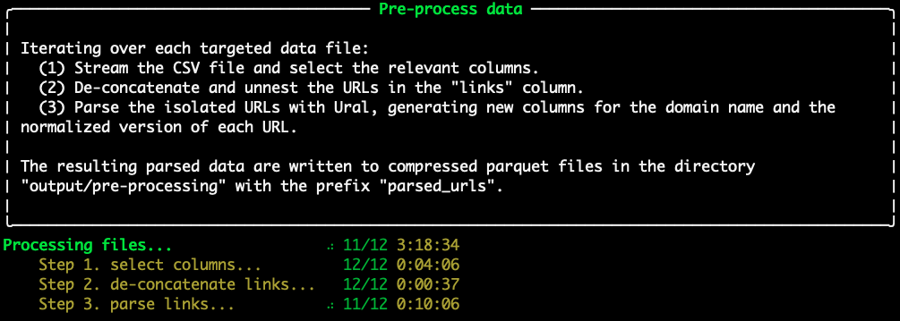
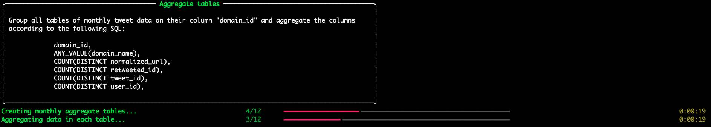

# Enlinkenment

A modular workflow for parsing and enriching URL data.

---
## Table of Contents
- [Installation](#installation)
- [Workflow](#workflow)
- [Performance](#performance)
---
## Installation
1. Create a new virtual environment with Python 3.11.
1. Clone the repository from GitHub onto your local machine.
    ```shell
    git clone git@github.com:medialab/enlinkenment.git
    cd enlinkenment
    ```
2. Install Python dependencies.
    ```shell
    pip install -r requirements.txt
    ```
3. Run the process [`src/main.py`](src/main.py) on your data file or on a directory containing data files with a `.csv` or `.gz` extension. At least one YouTube API key is necessary to enrich the data with YouTube information.
    ```shell
    python src/main.py -d DATA/ -f "**/*.csv" -k KEY1 -k KEY2
    ```
- `-d` [--data] : data file or directory of files
- `-f` [--glob-file-pattern] : pattern to capture files in the directory
- `-k` [--key] : YouTube API key (provide if not `-c`)
- `-c` [--config-file] : JSON or YAML file with an array of YouTube API keys (provide if not `-k`)

#### Config file syntax
```json
{
    "youtube":{
        "key_list":[
            "Key1",
            "Key2",
        ]
    }
}
```

## Workflow

The script processes either a single data file or a group of data files matching a certain pattern in a directory. The default file pattern targets g-zipped CSV files (`**/*.csv.gz`).

### Step 1. Pre-process data
The first step is to parse the data in each targeted data file and, for each CSV file, derive a compressed parquet file that includes a selection of data from the original file as well as the the domain name and the normalized version of all the file's links. The latter data is parsed with tools from [Ural](https://github.com/medialab/ural).



### Step 2. Import pre-processed data
This step produces a series of tables in the database, which contain tweet and link data for each month. First, while keeping track of which months are represented in which files, a table is created for every month in the data. Second, all tweet and link data is inserted into the table that corresponds to the month of the tweet's publication. The created table names follow the following format: `tweets_in` + `YEAR`+ `MONTH`. For example, all tweet and link data originating from Janurary 2022 would be imported into a table named `tweets_in_2022_01`. By first parsing the months in all the files, this step accommodates data files that include tweets from multiple months.


### Step 3. Aggregate each month's domain names
In the tables for monthly aggregates of links' domain names, group each monthly tweet-link table according to the columns `domain_name` and `domain_id` and sum counts of the remaining metrics. The result of this step is a new series of tables in the database; each one corresponds to one of the monthly tweet-link tables. The table names follow the format: `domains_in` + `YEAR` + `MONTH`.



### Step 4. Combine aggregated domain names


### Step 5. Aggregate each month's YouTube links
In the tables for monthly aggregates of links from YouTube, group each monthly tweet-link table according to the column `normalized_url` and sum counts of the remaining relevant metrics if the `domain_name` = `youtube.com`. The result of this step is a new series of tables in the database; each one corresponds to one of the monthly tweet-link tables. The table names follow the format: `youtube_links_in` + `YEAR` + `MONTH`.


### Step 6. Combine aggregated YouTube links


Error: Still ran out of memory during recursive aggregation of YouTube links. The script crashes at the last group by, on a combined table that has 75,196,705 rows.

```
Traceback (most recent call last):
  File "/Users/kelly.christensen/Dev/enlinkenment/src/main.py", line 202, in <module>
    main()
  File "/Users/kelly.christensen/.pyenv/versions/enlinkenment/lib/python3.11/site-packages/click/core.py", line 1130, in __call__
    return self.main(*args, **kwargs)
           ^^^^^^^^^^^^^^^^^^^^^^^^^^
  File "/Users/kelly.christensen/.pyenv/versions/enlinkenment/lib/python3.11/site-packages/click/core.py", line 1055, in main
    rv = self.invoke(ctx)
         ^^^^^^^^^^^^^^^^
  File "/Users/kelly.christensen/.pyenv/versions/enlinkenment/lib/python3.11/site-packages/click/core.py", line 1404, in invoke
    return ctx.invoke(self.callback, **ctx.params)
           ^^^^^^^^^^^^^^^^^^^^^^^^^^^^^^^^^^^^^^^
  File "/Users/kelly.christensen/.pyenv/versions/enlinkenment/lib/python3.11/site-packages/click/core.py", line 760, in invoke
    return __callback(*args, **kwargs)
           ^^^^^^^^^^^^^^^^^^^^^^^^^^^
  File "/Users/kelly.christensen/Dev/enlinkenment/src/main.py", line 181, in main
    recursively_aggregate_tables(
  File "/Users/kelly.christensen/Dev/enlinkenment/src/aggregate.py", line 236, in recursively_aggregate_tables
    connection.execute(query)
duckdb.OutOfMemoryException: Out of Memory Error: could not allocate block of 262144 bytes (27487666176/27487790694 used) 
```

## Performance

Number of files: 12

Combined file size: 310G
